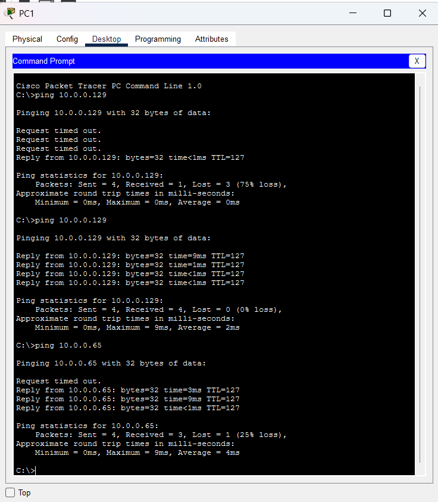

# 3-VLAN Network Topology with Traditional Inter-VLAN Routing

This repository features a Cisco Packet Tracer project demonstrating a segmented local area network (LAN) built for three corporate departments: **Engineering**, **HR**, and **Sales**. 

Traffic isolation and security are enforced at Layer 2 using Virtual Local Area Networks (VLANs). Inter-department communication is facilitated at Layer 3 using **traditional inter-VLAN routing**, utilizing dedicated physical links connecting a modular switch to a router.

---

## 📸 Network Topology Diagram

---

## 📊 Addressing & VLAN Segmentation Table

| Department / VLAN | Subnet | Device | IP Address | Subnet Mask | Default Gateway |
| :--- | :--- | :--- | :--- | :--- | :--- |
| **VLAN 10: Engineering** | `10.0.0.0/26` | PC1   PC2 | `10.0.0.1`   `10.0.0.2` | `255.255.255.192` | *[Your Router Port IP]* |
| **VLAN 20: HR** | `10.0.0.64/26` | PC3   PC4 | `10.0.0.65`   `10.0.0.66` | `255.255.255.192` | *[Your Router Port IP]* |
| **VLAN 30: Sales** | `10.0.0.128/26` | PC5   PC6 | `10.0.0.129`   `10.0.0.130` | `255.255.255.192` | *[Your Router Port IP]* |

---

## 🛠️ Configuration & Implementation

### 1. Custom Hardware Modification
* **Switch Customization:** Modified a standard `Switch-PT-Empty` framework by manually installing hardware modules to provide exactly **3 GigabitEthernet interfaces** and **6 FastEthernet interfaces**. This tailored setup matches the strict link requirements of the network topology.

### 2. Layer 2 Switch Configuration
* Created and named the active VLAN databases (`VLAN 10 Engineering`, `VLAN 20 HR`, and `VLAN 30 Sales`).
* Configured access ports and assigned them to their respective broadcast domains:
  * **VLAN 10:** Interfaces `Fa0/1` and `Fa1/1`
  * **VLAN 20:** Interfaces `Fa2/1` and `Fa3/1`
  * **VLAN 30:** Interfaces `Fa4/1` and `Fa5/1`
* Configured the 3 GigabitEthernet ports to map dedicated communication streams upwards to individual router ports.

### 3. Layer 3 Router Configuration
* Assigned individual IP addresses to three physical GigabitEthernet interfaces on the Cisco 2911 router.
* Each interface functions as the dedicated **Default Gateway** for its respective VLAN subnet pool, allowing traffic to hop between subnets safely.

---

## ✅ Verification & Connectivity Testing

To prove that Inter-VLAN routing functions perfectly across the subnets, connection connectivity tests were initiated from **PC1 (VLAN 10: Engineering)** to endpoints inside the other departments:

1. **Ping to Sales Subnet:** PC1 successfully reached **PC5 (`10.0.0.129`)** inside VLAN 30.
2. **Ping to HR Subnet:** PC1 successfully reached **PC3 (`10.0.0.65`)** inside VLAN 20.

*Note: The initial "Request timed out" messages seen during the first test cycles are standard network behaviors. This delay occurs while the Address Resolution Protocol (ARP) resolves hardware MAC addresses across the routing interfaces.*

### Connectivity Proof (Command Prompt Verification)

---

## 🚀 How to Run the Project
1. **Prerequisites:** Make sure you have **Cisco Packet Tracer** installed on your computer.
2. **Download Repository:** Clone this project or download the `vlan-lab-topology.pkt` file directly.
3. **Execution:** Open the `.pkt` file using Packet Tracer.
4. **Validation:** Click on any PC, open its Desktop Command Prompt, and run a `ping` command toward an IP address in another department to witness real-time packet routing.

